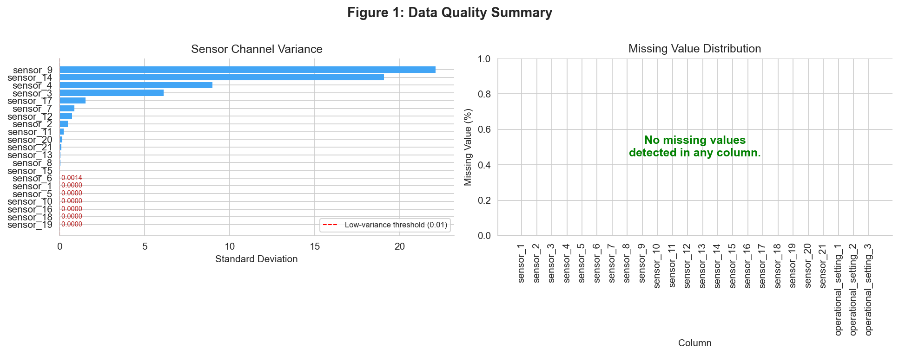
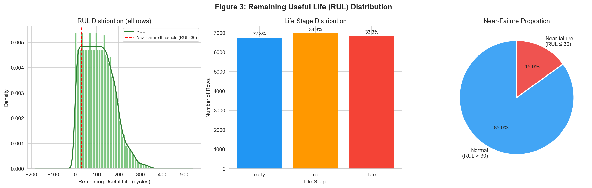
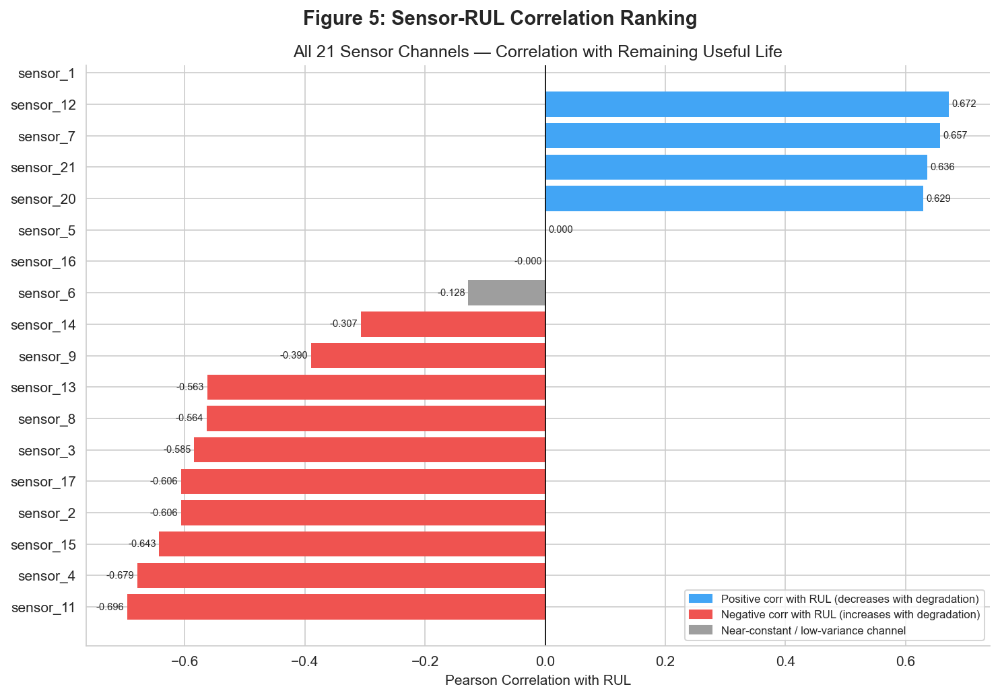
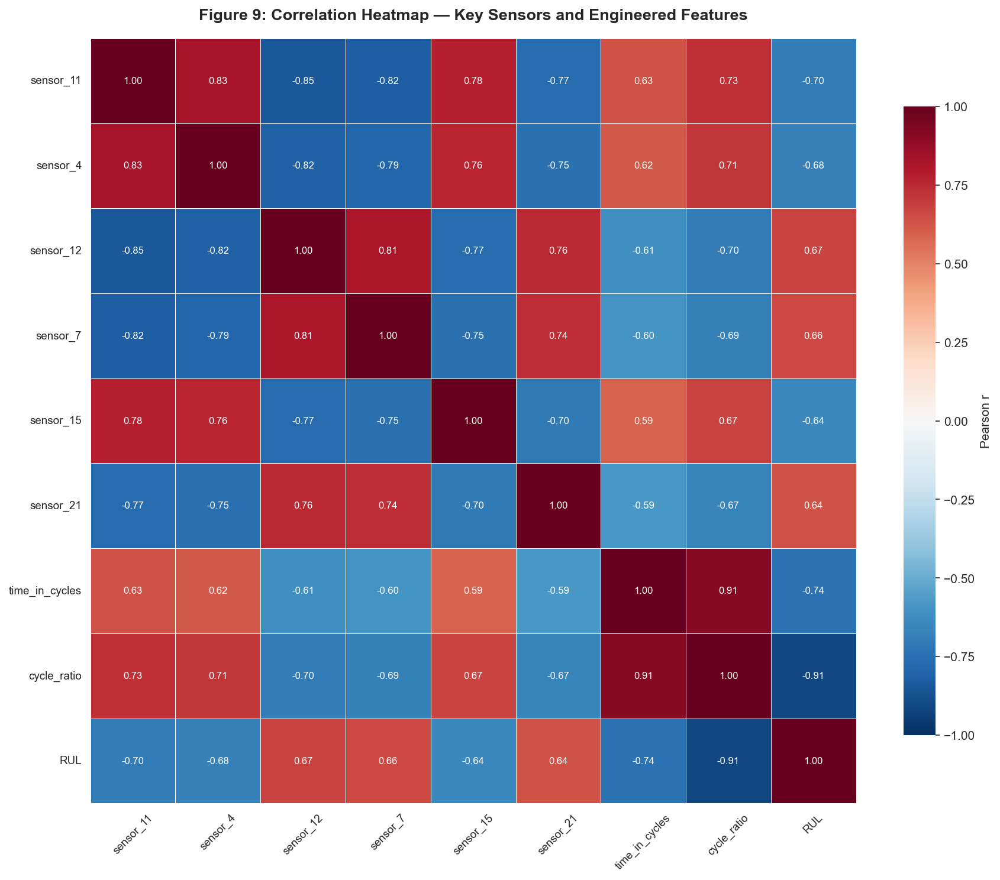
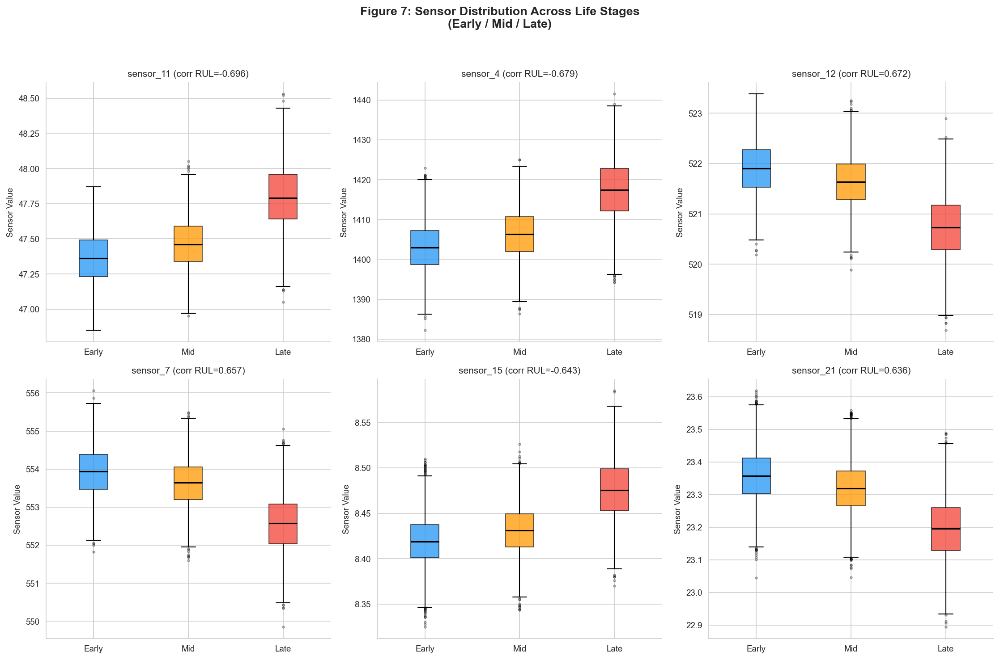
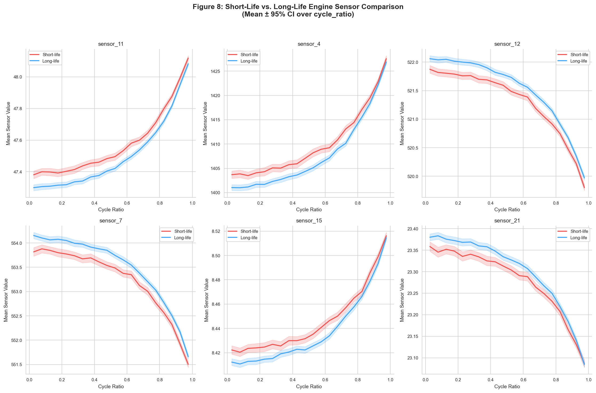
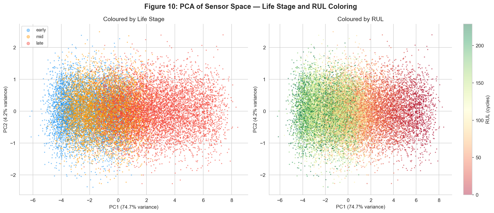

# Exploratory Data Analysis for Smart Factory Predictive Maintenance Using NASA Turbofan Engine Sensor Data

**Module:** IOT106TC Big Data Analytics  
**Assignment:** Assignment 1 — Exploratory Data Analysis Report  
**Scenario:** Scenario 1 — Smart Factory Predictive Maintenance  
**Dataset:** NASA C-MAPSS Turbofan Engine Degradation Simulation — FD001 Subset  
**Companion notebook:** `notebooks/Assignment1_SmartFactory_EDA.ipynb`  

---

## Executive Summary

This report presents the Exploratory Data Analysis (EDA) of the NASA C-MAPSS Turbofan Engine Degradation Simulation dataset (FD001 training subset), in a Smart Factory predictive maintenance framing. The file `train_FD001.txt` comprises **100** engines × **20,631** cycle-level rows and **26** raw sensor/setting columns—21 anonymised IoT sensor channels plus three operational settings. The notebook calculates Remaining Useful Life (RUL) from run-to-failure labels, derives lifecycle features (`cycle_ratio`, `life_stage`, `near_failure`, rolling means), and screens all sensors. Approximately **seven** sensor channels exhibit near-zero variance (threshold: standard deviation &lt; 0.01) and contribute little diagnostic information. **Fourteen** non-constant channels show |Pearson *r*| &gt; 0.3 with RUL; the strongest single relationship is **sensor_11** (*r* = −0.696). **15.0%** of rows fall in the exploratory near-failure band (RUL ≤ 30 cycles). The cleaned dataset `data/processed/SmartFactory_cleaned.csv` contains **42** columns and is ready for Assignment 2 RUL regression and near-failure classification. Figures 1–10 below are produced by the notebook and saved under `figures/`.

---

## 1. Introduction and Business Understanding

### 1.1 Business Context

Modern industrial environments increasingly rely on IoT sensor networks to monitor the health of critical machinery in real time. In aviation and manufacturing, turbine engines and turbofan units represent high-value, safety-critical assets where unplanned failure carries severe operational, financial, and safety consequences. The traditional maintenance approach — fixed-interval scheduled maintenance — results in either premature replacement of components that still have useful life remaining, or reactive maintenance following unexpected failures. Both outcomes are economically inefficient and, in the latter case, potentially hazardous.

Predictive maintenance addresses this gap by analysing continuous sensor data to estimate how much useful life an asset has remaining, enabling maintenance to be scheduled at the optimal point: early enough to prevent failure, late enough to avoid unnecessary servicing. This Assignment uses the NASA C-MAPSS FD001 dataset as a proxy for an industrial IoT scenario in which sensor-equipped engines are monitored from installation to end-of-life.

### 1.2 Problem Statement

The central problem for Assignment 1 is not yet predictive modelling, but **data understanding and preparation**. Before a reliable RUL prediction system can be built, three questions must be answered:

1. **What does the data look like?** Structure, quality, completeness, and scale.
2. **What patterns are present?** How do sensors behave over an engine's lifecycle? Which channels carry useful degradation signals?
3. **What features should be engineered?** Which representations will support Assignment 2 modelling?

The goal is to produce a clean, well-understood dataset and a grounded set of findings that inform both maintenance operations and future modelling strategy.

### 1.3 Stakeholder Analysis

| Stakeholder | Primary Concern | Relevance to This Analysis |
|-------------|----------------|---------------------------|
| **Plant / Fleet Manager** | Minimise unplanned downtime | Understanding which engines are near failure and why |
| **Maintenance Director** | Schedule preventive maintenance efficiently | Identifying degradation onset timing across the fleet |
| **Finance Director** | Reduce cost of unnecessary maintenance and downtime losses | Quantifying sensor signal quality to prioritise investment in data-driven maintenance |
| **Safety / Reliability Team** | Prevent catastrophic failure | Identifying near-failure engine states and most informative warning signals |
| **Data / IoT Engineering Team** | Maintain sensor pipeline; build predictive models | Understanding which sensor channels to prioritise; selecting features for Assignment 2 |

### 1.4 Success Criteria

The analysis is considered successful if:

- RUL is correctly calculated and validated for all engines.
- Data quality is fully assessed, documented, and addressed.
- At least 8 engines are analysed and compared.
- At least 10 sensor channels are explored in depth.
- Informative sensor channels are identified and ranked.
- Engine degradation patterns are characterised and interpreted.
- A cleaned, feature-enriched dataset is produced and saved.
- Business-relevant recommendations are supported by evidence.
- Responsible AI use is documented in the AI Collaboration Report.

---

## 2. Data Understanding

### 2.1 Data Source and Structure

The dataset used in this analysis is the **NASA C-MAPSS (Commercial Modular Aero-Propulsion System Simulation) Turbofan Engine Degradation Simulation Data**, specifically the **FD001 training subset**. The data was generated by NASA's Prognostics Center of Excellence (PCoE) and is widely used in the predictive maintenance research community as a benchmark for RUL prediction algorithms.

**Dataset source:** NASA PCoE Data Repository  
**File used:** `train_FD001.txt`  
**Operating condition:** Single flight condition (FD001 operates under one fixed operational regime, making normalisation straightforward)  
**Failure mode:** High Pressure Compressor (HPC) degradation (single fault mode)

The dataset is a **run-to-failure** dataset: each engine is recorded from its first operational cycle until it fails. The last recorded cycle for each engine is its failure cycle. This design allows Remaining Useful Life to be unambiguously calculated in retrospect.

### 2.2 Dataset Schema

The file contains no header. Data is whitespace-separated with 26 columns, assigned as follows:

| Column | Name | Description |
|--------|------|-------------|
| 1 | `unit_number` | Engine identifier |
| 2 | `time_in_cycles` | Operational cycle index (1 = first cycle) |
| 3–5 | `operational_setting_1/2/3` | Flight condition parameters |
| 6–26 | `sensor_1` to `sensor_21` | IoT sensor channel readings |

Sensor physical identities are not explicitly documented in the dataset file. To avoid overclaiming physical meaning, this analysis refers to all channels as anonymised sensor labels (sensor_1 through sensor_21).

### 2.3 Data Quality Assessment

| Quality Metric | Value |
|---------------|-------|
| Total rows (raw) | 20,631 |
| Total rows (after deduplication) | 20,631 |
| Columns (raw schema) | 26 |
| Missing values (total) | 0 |
| Duplicate rows removed | 0 |
| Near-constant sensor channels (std &lt; 0.01) | **7** |
| Rows with ≥1 sensor value outside the 3×IQR fence *(flag only; no row drops)* | **1,911** |
| Engineered features added (see notebook) | **16** |

**Missing values:** None detected in `train_FD001.txt` across all loaded columns (`outputs/data_quality_summary.csv`).

**Duplicate rows:** Zero exact duplicates; row count unchanged.

**Near-constant sensors:** Channels **sensor_1**, **sensor_5**, **sensor_6**, **sensor_10**, **sensor_16**, **sensor_18**, and **sensor_19** all have pooled standard deviation **below 0.01** under the notebook rule. Correlation with RUL is undefined for strictly constant series and negligible for the marginal-variance cases. These channels are **retained** in the exported CSV but **marked as low-information** for monitoring prioritisation (`outputs/sensor_rul_correlation.csv`).

**Outlier handling policy:** Row-level IQR fencing (multiplier 3×, **any sensor**) **flags 1,911 rows** once per row if any channel breaches its fence—**without row deletion**. Late-life extremes are treated as plausible degradation artefacts.

Figure 1 shows the pooled standard deviation ladder (with the 0.01 rule-of-thumb cutoff) alongside the absence of missing readings.

*Figure 1. Data-quality summary plots generated in the notebook.*

### 2.4 Initial Statistical Summary

Engine-level lifetime `max_cycle` per `unit_number` ranges from **128** to **362** cycles (**mean ~206**, **median 199**, **standard deviation ~46**). The positively skewed distribution (**skew ≈ 1.02**) indicates a long tail of **long-lived** engines rather than symmetry around the mean—a pattern consistent with heterogeneous wear accrual in a stochastic degradation process.

Across all rows, **`time_in_cycles`** spans **1–362** (**mean ~108.8**, **std ~68.9**). Uncapped **`RUL`** mirrors the same dispersion (**max 361**) because RUL = `max_cycle` − `time_in_cycles`.

Illustrative univariate dispersion for **`sensor_2`** (among the trending channels used in lifecycle illustrations): approximately **641.21–644.53** (**mean ~642.68**, **std ~0.50**).

Operational settings **`operational_setting_1`** and **`operational_setting_2`** show **minimal** dispersion (standard deviations ~0.0022 and ~0.00029; only a handful of unique values). **`operational_setting_3`** is **constant at 100.0** for every observation—consistent with FD001's single-flight-regime textbook description.

---

## 3. Data Cleaning and Preparation

### 3.1 Cleaning Strategy and Rationale

The cleaning strategy follows a conservative, domain-aware approach that prioritises **preserving signal over removing noise**:

1. **Missing values:** Column-wise scan—none found on FD001 train.
2. **Duplicate rows:** No exact duplicates removed—count remained zero throughout.
3. **Constant features:** Flag channels with pooled std &lt; 0.01; **do not drop** preemptively ahead of Assignment 2 feature selection.
4. **Outlier screening:** Flag using a 3×IQR fence; **do not auto-delete**.
5. **Type validation:** All 26 operational/sensor inputs are numeric; no coercion failures.

### 3.2 RUL Calculation Methodology

RUL at cycle *t* was calculated as:

RUL_t = max_cycle_for_that_engine − time_in_cycles_t

Here *time_in_cycles_t* is the operational cycle index for that row, and max_cycle_for_that_engine is that engine's final recorded cycle. For each engine, the notebook verified that the final recorded row had RUL = 0. All **100** engines passed this check.

### 3.3 Feature Engineering

Beyond the raw columns, the engineered fields include `max_cycle`, `RUL`, `cycle_ratio`, ordinal `life_stage` (early: `cycle_ratio` ≤ 0.33; mid: ≤ 0.67; late: else), exploratory `near_failure` (indicator for RUL ≤ 30), `capped_RUL`, and **`sensor_*_roll20`** rolling means for the **top 10 absolute RUL-correlated** active sensors (**window = 20** cycles within each engine timeline). See **`outputs/feature_summary.csv`** for the definitive column glossary.

### 3.4 Before-and-After Data Quality Report

| Metric | Before | After (cleaned CSV) |
|--------|-------:|---------------------:|
| Total rows | 20,631 | 20,631 |
| Columns | 26 | **42** |
| Missing values | 0 | 0 |
| Duplicate rows | 0 | 0 |
| Near-constant sensors flagged | — | **7** |
| Rows flagged by 3×IQR rule (≥1 sensor) | — | **1,911** |
| Engineered numeric/categorical derivatives | 0 | **16** |

---

## 4. Exploratory Data Analysis

### 4.1 Engine Lifecycle and RUL Distribution

The training split tracks **100** independent engines (**20,631** pooled observations).

**Lifetime distribution:** **`max_cycle`** min **128**, max **362**, mean **≈206.31**, median **199**, σ **≈46.34** (*Figure 2*). **Tertile cut-points** on `max_cycle` separate **short** (≤ **188** cycles), **medium** (**188–213** cycles), and **long** (&gt; **213** cycles) lifetime cohorts used for comparative plots.

**RUL distribution:** Per-row RUL ∈ **[0, 361]**; the histogram is **right-skewed** (*Figure 3*) because early-life rows contribute many high-RUL samples. **15.0%** of rows satisfy **RUL ≤ 30** (`near_failure = 1`). Outside that band, mean RUL is **≈124** cycles (median **118**), illustrating a long **pre-critical** monitoring window.

**Life-stage counts (row-level tertiles on `cycle_ratio`):** **early 6,767**, **mid 6,999**, **late 6,865**—balanced by construction.

Figure 4 traces **`sensor_2`** (strong |*r*| with RUL) for **eight** stratified engines spanning the lifetime spectrum.

*Figure 2. Engine lifetime distribution.*

*Figure 3. RUL and lifecycle-stage composition.*

*Figure 4. Multi-engine lifecycle examples (≥8 engines required).*

### 4.2 Univariate Sensor Analysis

All **21** sensors were screened for variance and correlation with RUL (`outputs/sensor_rul_correlation.csv`).

**Near-constant (7):** **sensor_1, sensor_5, sensor_6, sensor_10, sensor_16, sensor_18, sensor_19**.

**Active channels:** **14** sensors remain after excluding the seven low-variance channels.

**Channels with |*r*(&nbsp;sensor, RUL&nbsp;)| &gt; 0.3:** **14** sensors — **sensor_11, sensor_4, sensor_12, sensor_7, sensor_15, sensor_21, sensor_20, sensor_2, sensor_17, sensor_3, sensor_8, sensor_13, sensor_9, sensor_14** (descending by |*r*|).

**Top five by |RUL correlation| — empirical ranges on raw train rows:**

- **sensor_11:** 46.85–48.53 (mean **47.54**, σ **0.267**).  
- **sensor_4:** 1382.25–1441.49 (mean **1408.93**, σ **9.00**).  
- **sensor_12:** 518.69–523.38 (mean **521.41**, σ **0.738**).  
- **sensor_7:** 549.85–556.06 (mean **553.37**, σ **0.885**).  
- **sensor_15:** 8.32–8.58 (mean **8.44**, σ **0.038**).

These statistics support monotonic **trendability** rather than discrete jump behaviour.

### 4.3 Sensor–RUL Relationships

Figure 5 ranks **Pearson *r*(sensor, RUL)** for all 21 channels (grey bars mark the seven low-variance sensors). The top five signed correlations are **sensor_11 (−0.696)**, **sensor_4 (−0.679)**, **sensor_12 (+0.672)**, **sensor_7 (+0.657)**, **sensor_15 (−0.643)**.

Figure 6 bins **`cycle_ratio`** (20 equal-width bins) and plots population means ±95% CI for the **six** highest-|*r*| **non-constant** sensors used in the notebook (**sensor_11, sensor_4, sensor_12, sensor_7, sensor_15, sensor_21**).

Figure 9 heatmaps pairwise correlations among those six sensors plus **`time_in_cycles`**, **`cycle_ratio`**, and **`RUL`**, highlighting multicollinearity that Assignment 2 should regularise or compress.

**Directionality note:** Negative *r* with RUL implies the channel **rises** as failure approaches; positive *r* implies it **falls**—both are degradation-informative.

*Figure 5. Sensor–RUL correlation ranking.*

*Figure 6. Key sensor trends over normalised life.*

*Figure 9. Correlation structure for modelling-relevant variables.*

### 4.4 Comparative Engine Degradation Patterns

Figure 7 compares **early / mid / late** distributions for the same six sensors—**interquartile expansion** in **late** life is visible for several channels, supporting heterogeneous end-stage wear.

Figure 8 contrasts **short-life** (bottom quartile of `max_cycle`) versus **long-life** (top quartile) engines: **trajectory shapes align qualitatively**, but **levels and slopes diverge**, so **lifetime cohort** carries signal beyond a simple time rescaling.

*Figure 7. Life-stage sensor comparison.*

*Figure 8. Short-life versus long-life engine cohorts.*

### 4.5 Pattern and Trend Discovery

1. **Divergence onset varies:** **sensor_4** and **sensor_11** accumulate visible mean drift from **`cycle_ratio` ≈ 0.2 onward** (`Figure 6`), whereas **`sensor_12`** and **`sensor_7`** stay comparatively flat until the **upper third** of normalised life, then steepen—consistent with staged degradation behaviour in this simulated run-to-failure dataset.
2. **Late-stage variance inflation:** Elevated spreads in **`late`** boxes (`Figure 7`) motivate **ensemble** dashboards rather than single-threshold alarms.
3. **Operational settings constrained:** **`operational_setting_3`** is constant; **`_1`/ `_2`** are near piecewise-constant—lifetime spread (**234** cycle swing) therefore **cannot** be explained by observable flight-condition knobs in FD001 (**Figure 2** vs. Section 2.4).
4. **Structured low-information sensors:** Near-constant series are **globally flat**, suggesting low diagnostic variation in these anonymised channels rather than an obvious missing-data or sensor-dropout issue.

### 4.6 Advanced Analysis: PCA Life-Stage Visualisation

Principal components analysis (standardised) used the ten active sensors ranked highest by absolute correlation with RUL in training (sensor_11, sensor_4, sensor_12, sensor_7, sensor_15, sensor_21, sensor_20, sensor_2, sensor_17, sensor_3).

Principal components 1 and 2 jointly explain approximately 78.8% of feature variance, with PC1 explaining about 74.7% and PC2 about 4.2%. Figure 10 is coloured by life stage (early, mid, late) and by RUL, and shows monotonic stratification along PC1, supporting the view that the selected sensor channels form a learnable degradation-related representation for Assignment 2.

*Figure 10. PCA of the top-ten correlated sensor manifold.*

---

## 5. Business Insights and Recommendations

### 5.1 Key Findings Summary

**Finding 1 — Significant engine lifetime variability**  
*Observation:* Lifetimes span **128–362** cycles (σ **≈46**).  
*Evidence:* Figure 2; **`outputs/engine_level_summary.csv`**  
*Business implication:* Fixed-interval policies mis-allocate overhaul for early failures and defer attention on unusually durable assets.

**Finding 2 — Near-failure spans a minority slice of telemetry**  
*Observation:* **15.0%** of readings sit in **RUL ≤ 30**; remainder averages **≈124** cycles of headroom.  
*Evidence:* Figure 3; engineered `near_failure` label  
*Business implication:* Condition-based rules can flag wear **before** the critical band if rolling statistics are tracked.

**Finding 3 — Seven channels are effectively non-informative**  
*Observation:* **sensor_1, sensor_5, sensor_6, sensor_10, sensor_16, sensor_18, sensor_19** fall below the **0.01** std rule.  
*Evidence:* Figure 1; **`outputs/data_quality_summary.csv`**  
*Business implication:* Edge filtering or slower sampling on these tags may reduce bandwidth, but this should be validated before deployment beyond the FD001 subset.

**Finding 4 — Concentrated RUL correlation in a sensor subset**  
*Observation:* **sensor_11** leads at |*r*| = **0.696**; follow-on leaders include **sensor_4, sensor_12, sensor_7, sensor_15, sensor_21** (all |*r*| &gt; **0.63**).  
*Evidence:* Figure 5; **`outputs/sensor_rul_correlation.csv`**  
*Business implication:* Dashboards and models should centre on this compact set before expanding breadth.

**Finding 5 — Monotonic lifecycle separation**  
*Observation:* Binned means and **early/mid/late** boxplots shift coherently for the six primary sensors (`Figures 6–7`; **`outputs/sensor_life_stage_shift.csv`**).  
*Business implication:* Trend slopes (optionally on rolling means) are credible early-warning features.

**Finding 6 — Lifetime quartiles separate average trajectories**  
*Observation:* Short- versus long-life cohort means diverge in level/slope while preserving directional similarity (`Figure 8`).  
*Evidence:* Figure 8; **`outputs/engine_level_summary.csv`**  
*Business implication:* Fleet segmentation by historical `max_cycle` may aid risk triage when combined with live sensors.

**Finding 7 — PCA compresses variance with interpretable PC1**  
*Observation:* **PC1+PC2 ≈ 78.8%** variance; **life_stage** and **RUL** colour gradients align with **PC1** (`Figure 10`).  
*Evidence:* Figure 10; notebook PCA cell  
*Business implication:* Latent representations or regularised regression on PC scores are defensible baselines for Assignment 2.

### 5.2 Data-Driven Recommendations

**R1 — Condition dashboards on the six primary sensors**  
*Action:* Visualise **sensor_11, sensor_4, sensor_12, sensor_7, sensor_15, sensor_21** with **20-cycle** rolling means.  
*Evidence:* Figures 5–6.  
*Expected impact:* Earlier degradation visibility; reduced calendar-only dependence.  
*Ease:* Medium | *Priority:* High  

**R2 — Maintenance triage using a model-estimated risk band**  
*Action:* Use the retrospective **RUL ≤ 30** band as the training definition for high-risk states in Assignment 2; in future deployment, trigger inspection when a trained model estimates RUL falls within this range or near-failure probability exceeds a chosen threshold.  
*Evidence:* Figure 3; 15.0% of training rows fall in this band.  
*Expected impact:* Risk-ranked work orders based on model output rather than calendar schedule.  
*Ease:* Low (EDA definition) → Medium (deployment) | *Priority:* High  

**R3 — Deprioritise the seven flat channels**  
*Action:* Downsample or archive **sensor_1, sensor_5, sensor_6, sensor_10, sensor_16, sensor_18, sensor_19** at the edge.  
*Evidence:* Figure 1.  
*Expected impact:* Potentially lower ingest and storage cost; limited diagnostic loss in the FD001 training subset, pending validation on other operating conditions.  
*Ease:* Low | *Priority:* Medium  

**R4 — Engine-aware supervised learning in Assignment 2**  
*Action:* Regress **RUL** (and optionally classify `near_failure`) using deployable input features — **`time_in_cycles`**, top active sensor channels, and rolling sensor summaries — while **holding out entire engines** for validation to prevent temporal leakage.  
*Evidence:* Figures 5, 8, 9; Findings 4–7.  
*Expected impact:* Operational RUL estimates grounded in sensor data available at prediction time.  
*Ease:* Medium | *Priority:* High  

**R5 — Audit the shortest-lived engines**  
*Action:* In a real deployment, cross-reference the **six** units with **`max_cycle` &lt; 148** cycles against maintenance or inspection logs (not available in the simulation dataset) to determine whether early failure reflects manufacturing variation, unusual operating loads, or data artefacts.  
*Evidence:* Figure 8; **`outputs/engine_level_summary.csv`**  
*Expected impact:* Operational insight into whether short-life outliers are learnable from sensor history or driven by factors outside the dataset.  
*Ease:* Low (cross-referencing exercise in a real system) | *Priority:* Medium  

### 5.3 Preliminary Modeling Plan for Assignment 2

- **Targets:** `RUL` regression primary; `near_failure` classification secondary. `capped_RUL` (≤ 125 cycles) may be used as a transformed regression target for modelling stability, but **not as an input feature**.
- **Deployable input features:** `time_in_cycles`, top active sensor channels (sensor_11, sensor_4, sensor_12, sensor_7, sensor_15, sensor_21, sensor_20, sensor_2, sensor_17, sensor_3), and their 20-cycle rolling means. Operational settings are retained for completeness. Retrospective variables derived from the failure cycle — including `max_cycle`, `RUL`, `capped_RUL`, `near_failure`, `cycle_ratio`, and `life_stage` — are **not deployable input features**; they are useful for target construction, EDA grouping, and model evaluation only.
- **Validation:** Grouped splits by **`unit_number`** — entire engines are held out, not individual rows, to prevent temporal data leakage.  
- **Models:** Ridge baseline → Random Forest / gradient boosting ensembles; Logistic Regression and Random Forest for classification.  
- **Metrics:** RMSE / MAE for regression; F1 / ROC-AUC for alert classification.

---

## 6. AI Collaboration Report

*Full disclosure:* `reports/AI_Collaboration_Log.md`

AI tools assisted with **Python scaffolding**, **plot prototypes**, and **draft wording**; every numeric claim in this report was cross-checked against **`outputs/*.csv`**, the **executed notebook**, or recomputation (PCA variance). Analytical calls—**retaining outliers**, **seven-sensor low-info policy**, **30-cycle risk band**, and **figure down-selection**—were student-governed per the collaboration log.

---

## 7. Continuity Statement for Assignment 2

### 7.1 Chosen Scenario

**Smart Factory Predictive Maintenance** — FD001 continuity with **`SmartFactory_cleaned.csv`**.

### 7.2 Preliminary Modeling Goals

1. RUL regression  
2. `near_failure` classification  
3. Optional fleet dashboard tying alerts to rolling telemetry  

### 7.3 Most Promising Features for Assignment 2

The following features are **deployable at prediction time** — they are observable from live sensor streams without knowledge of the engine's future failure cycle.

| Feature group | Rationale |
|---------|-----------|
| `time_in_cycles` | Available at prediction time; captures accumulated operating age. |
| Top active sensors: `sensor_11, sensor_4, sensor_12, sensor_7, sensor_15, sensor_21, sensor_20, sensor_2, sensor_17, sensor_3` | Strong empirical association with retrospective RUL in EDA, supported by Figure 5 and outputs/sensor_rul_correlation.csv. |
| `sensor_*_roll20` rolling means for top sensors | Denoised trend features; capture gradual degradation trajectory. |
| Rolling slopes / deltas (if implemented in notebook) | May represent degradation speed rather than absolute sensor level. |
| Operational settings (`operational_setting_1/2/3`) | Low variation in FD001; retained for completeness and multi-subset generalisation. |

**Retrospective variables that must not be used as model inputs:**  
`max_cycle`, `RUL`, `capped_RUL`, `near_failure`, `cycle_ratio`, `life_stage` — all depend on knowing the future failure cycle. They serve as targets, EDA grouping labels, or evaluation references only.

### 7.4 Expected Modeling Approach

Ridge baseline → ensembles (RF, GBDT, XGBoost if licensed) with **Purged/grouped CV** across engines plus late-life weighting experimentation if needed.

### 7.5 Target Variables

Primary **`RUL`**; ancillary **`near_failure`**; modelling stabiliser **`capped_RUL`** (≤125).

---

## References

Saxena, A., Goebel, K., Simon, D., & Eklund, N. (2008). *Damage propagation modeling for aircraft engine run-to-failure simulation*. In Proceedings of the 1st International Conference on Prognostics and Health Management (PHM08), Denver, CO.

Ramasso, E., & Saxena, A. (2014). *Performance benchmarking and analysis of prognostic methods for CMAPSS datasets*. International Journal of Prognostics and Health Management, 5(2), 1–15.

NASA Prognostics Center of Excellence (PCoE). *CMAPSS Jet Engine Simulated Data.* Retrieved from https://www.nasa.gov/intelligent-systems-division/discovery-and-systems-health/pcoe/pcoe-data-set-repository/

---

## Appendix

All figures (Fig 1–10), cleaned dataset (`data/processed/SmartFactory_cleaned.csv`), output tables (`outputs/*.csv`), and the executed notebook (`notebooks/Assignment1_SmartFactory_EDA.ipynb`) are included in the project submission folder.
