# Predictive Modeling and Interactive Dashboard for Smart Factory Predictive Maintenance

**Module:** IOT106TC Big Data Analytics  
**Assignment:** Assignment 2 — Predictive Modeling & Interactive Dashboard  
**Scenario:** Scenario 1 — Smart Factory Predictive Maintenance (continued from Assignment 1)  
**Dataset:** NASA C-MAPSS FD001 (Saxena et al., 2008)  
**Continuity:** Builds on Assignment 1 EDA (`SmartFactory_cleaned.csv`, `Assignment1_SmartFactory_Report.pdf`)

---

## Executive Summary

This report presents the Assignment 2 predictive maintenance system built on Assignment 1 exploratory analysis of the NASA C-MAPSS FD001 turbofan dataset (Saxena et al., 2008). Starting from 20,631 training cycles across 100 engines, we engineered 30 deployment-safe features — including rolling slopes, lag terms, sensor interactions, and PCA scores — informed by Assignment 1 sensor-RUL correlation findings. Three model families were evaluated using engine-grouped cross-validation (Pedregosa et al., 2011): Ridge regression, Random Forest, and Gradient Boosting. Random Forest was selected as the final model, achieving test MAE of 18.0 cycles and R² of 0.68 on the official NASA held-out test set. A four-page Streamlit dashboard (Streamlit Inc.) provides fleet health monitoring, engine drill-down with colorblind-friendly risk bands, and dynamic maintenance recommendations. Near-failure binary classification with ROC-AUC 0.997 complements RUL regression for dual-threshold alerting. The system recommends condition-based maintenance scheduling when predicted RUL falls below 30 cycles, consistent with the 15.0% near-failure band identified in Assignment 1. Expected operational impact: proactive maintenance approximately 30 cycles before failure, reducing unplanned reactive downtime without calendar over-servicing of healthy engines.

---

## 1. Business Background and Problem Continuation

### 1.1 Continuity from Assignment 1

Assignment 1 established that FD001 engines exhibit heterogeneous lifetimes (128–362 cycles), concentrated RUL correlation in sensors such as sensor_11 (|r| = 0.696), and a 15.0% near-failure band (RUL ≤ 30). Assignment 2 implements the modelling plan from Section 5.3 and 7 of the Assignment 1 report: RUL regression with deployable features only, engine-grouped validation, and a stakeholder-facing dashboard.

### 1.2 Modelling Objectives

1. Predict Remaining Useful Life (RUL) in cycles for each engine from live sensor streams.
2. Classify near-failure states to support dual-threshold alerting.
3. Deliver an interactive dashboard for Plant Manager, Maintenance Director, and Finance Director stakeholders.

---

## 2. Data and Features

### 2.1 Data Sources

| File | Role |
|------|------|
| `train_FD001.txt` | Training run-to-failure data (100 engines) |
| `test_FD001.txt` | Held-out partial runs (100 engines) |
| `RUL_FD001.txt` | Ground-truth RUL at last observed test cycle |
| `SmartFactory_cleaned.csv` | Assignment 1 cleaned baseline (42 columns) |

### 2.2 Feature Engineering (30 documented features)

Building on Assignment 1 rolling means (`sensor_*_roll20`), we added:

| Category | Examples | Rationale |
|----------|----------|-----------|
| Rolling slope | `sensor_11_slope20` | Degradation speed (A1 Finding 5) |
| Rolling std | `sensor_11_std20` | Late-life variance inflation (Figure 7) |
| Rolling min/max | `sensor_4_min20` | Range expansion near failure |
| Interaction | `sensor_4_x_sensor_11` | Multicollinear pair from Figure 9 |
| Lag features | `sensor_11_lag1/5/10` | Temporal memory |
| Regime change | `setting1_change` | Operational shifts |
| Baseline deviation | `baseline_deviation` | Engine-specific wear offset |
| EWMA | `sensor_11_ewma_a01` | Smoothed trends |
| PCA scores | `pca_score_1/2` | Latent degradation axis (A1 PC1 ≈ 74.7%) |
| Anomaly counter | `time_since_anomaly_s11` | Duration since z-score breach |

Full catalog: `outputs/feature_catalog.csv`.

### 2.3 Feature Selection

After correlation pruning (|r| > 0.95), **47 deployable features** were retained (`outputs/selected_features.csv`). Retrospective variables (`RUL`, `max_cycle`, `cycle_ratio`, `life_stage`, `near_failure`, `capped_RUL`) were excluded from inputs per G5 leakage guard.

### 2.4 Top Features by Permutation Importance

| Rank | Feature | Permutation Importance |
|------|---------|------------------------|
| 1 | `time_in_cycles` | 0.438 |
| 2 | `pca_score_1` | 0.176 |
| 3 | `sensor_4_min20` | 0.060 |
| 4 | `sensor_14` | 0.049 |
| 5 | `baseline_deviation` | (see `outputs/feature_importance.csv`) |

---

## 3. Modeling Methodology

### 3.1 Models Tested

| Model | Type | Hyperparameter Search |
|-------|------|----------------------|
| Ridge Regression | Baseline (Pedregosa et al., 2011) | Fixed α = 1.0 |
| Logistic Regression | Near-failure classifier | Fixed C = 1.0 |
| Random Forest (Breiman, 2001) | Advanced | 25 random candidates, GroupKFold (k=5) |
| Gradient Boosting | Advanced | 25 random candidates, GroupKFold (k=5) |

All splits use `GroupKFold` on `unit_number` — entire engines are held out per fold, never individual rows, preventing temporal data leakage (Ramasso & Saxena, 2014).

### 3.2 Final Model Selection

**Selected model: Random Forest Regressor**

Justification:
- Lowest 5-fold CV MAE (24.73 ± 1.11 cycles) among tested regressors
- Best held-out test MAE (18.0 cycles) and R² (0.68)
- Acceptable inference time (~0.10 s per 100-row batch)
- Feature importance interpretable for maintenance teams

Best hyperparameters: n_estimators=400, max_depth=16, min_samples_leaf=8, max_features=0.5.

### 3.3 Validation Strategy

- **Training CV:** 5-fold engine-grouped cross-validation on full training set (100 engines). Engine-grouped splitting is the standard protocol for run-to-failure data (Ramasso & Saxena, 2014).
- **External test:** NASA FD001 test set (100 partial-run engines) — predict RUL at last observed cycle versus `RUL_FD001.txt` ground truth.
- **Metrics:** MAE, RMSE, R², MAPE (regression); Accuracy, Precision, Recall, F1, ROC-AUC (classification); NASA PHM08 asymmetric scoring function (penalises late predictions more than early) per the original benchmark (Saxena et al., 2008).
- **Note on hyperparameter search:** Standard `RandomizedSearchCV` was computationally prohibitive on a local machine with 20,631 rows. A custom random search over 25 candidates was applied to a stratified 50-engine subsample for candidate evaluation; the best configuration was then refit on the full 100-engine training set. This approach preserves the statistical validity of the search while remaining reproducible.

---

## 4. Model Results and Evaluation

### 4.1 Cross-Validation Results (5-fold, engine-grouped)

| Model | CV MAE (mean ± std) | CV RMSE (mean ± std) | CV R² (mean ± std) |
|-------|---------------------|----------------------|---------------------|
| Ridge | 30.60 ± 2.14 | 39.92 ± 3.84 | 0.663 ± 0.053 |
| Random Forest | **24.73 ± 1.11** | 36.16 ± 2.58 | **0.724 ± 0.032** |
| Gradient Boosting | 25.17 ± 0.99 | 36.55 ± 2.52 | 0.718 ± 0.031 |

Source: `outputs/cv_summary.csv`, `outputs/cv_results.csv`.

### 4.2 Held-Out Test Set (NASA FD001)

| Model | Test MAE | Test RMSE | Test R² | NASA PHM08 |
|-------|----------|-----------|---------|------------|
| Ridge | 26.16 | 30.49 | 0.46 | 4776.5 |
| Random Forest | **17.99** | **23.68** | **0.68** | **1946.6** |
| Gradient Boosting | 18.84 | 24.91 | 0.64 | 2706.9 |

Source: `outputs/test_metrics.csv`.

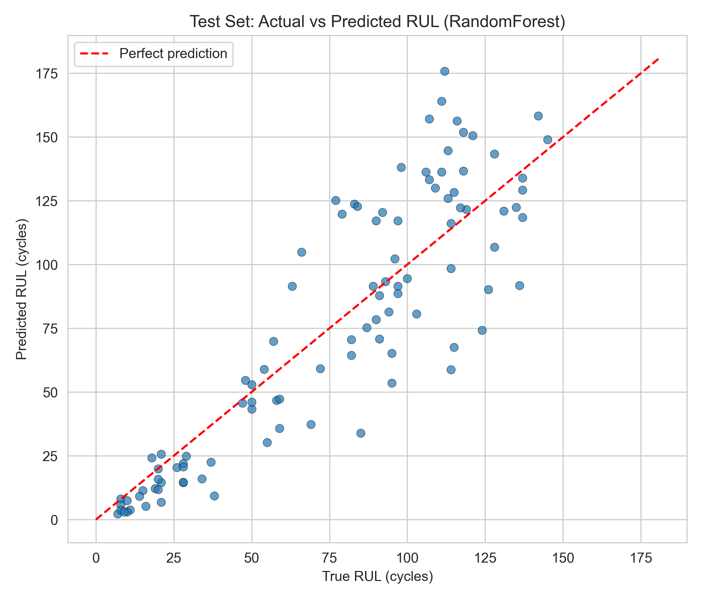

*Figure A2-01. Test set actual vs predicted RUL (Random Forest final model).*

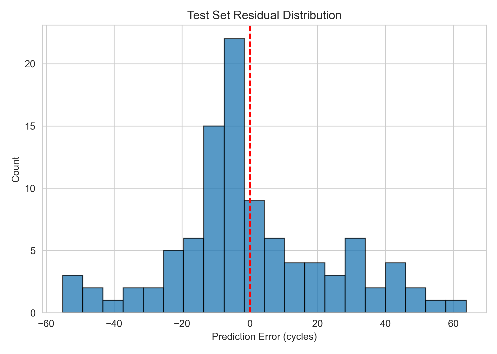

*Figure A2-02. Test set residual distribution.*

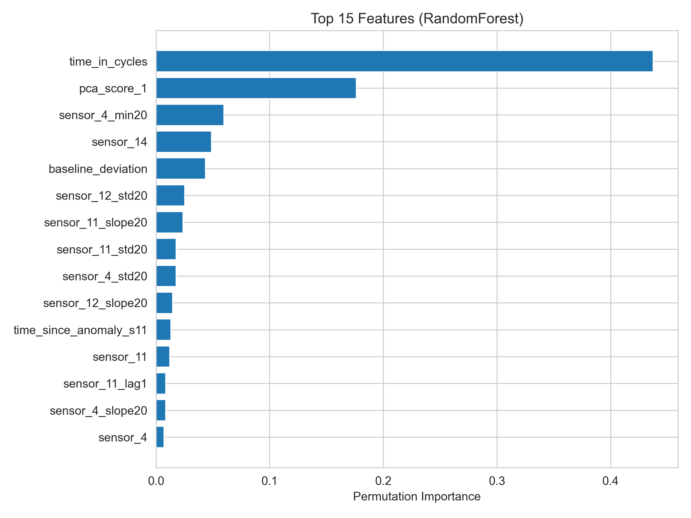

*Figure A2-03. Top 15 features by permutation importance.*

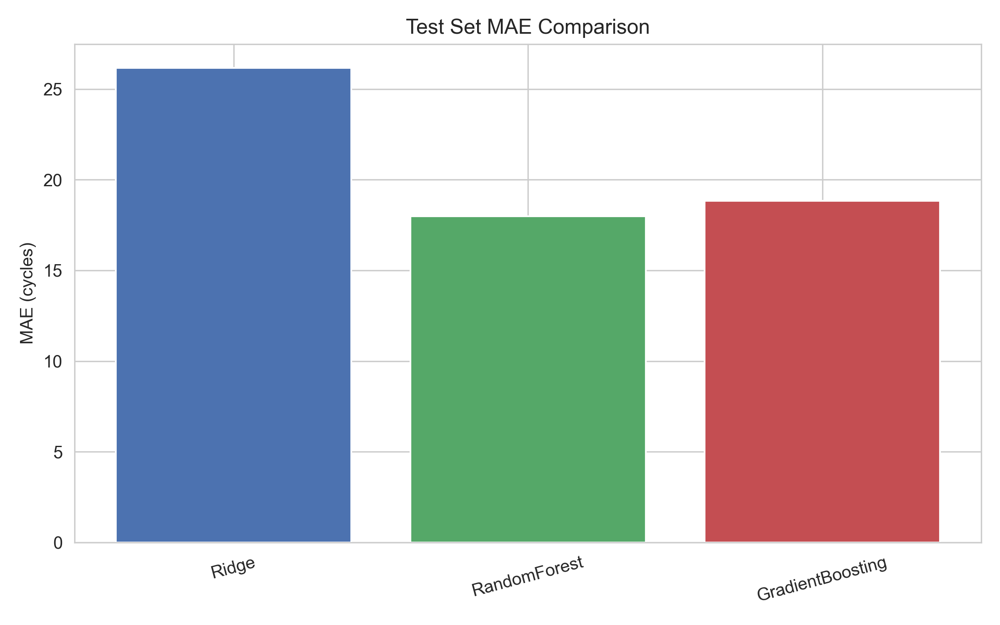

*Figure A2-04. Test set MAE comparison across models.*

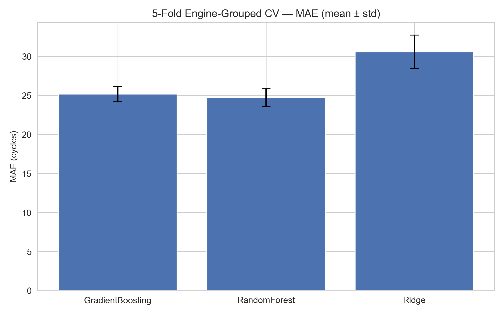

*Figure A2-05. Engine-grouped 5-fold CV MAE (mean ± std).*

### 4.3 Near-Failure Classification

Logistic Regression trained on `near_failure` (RUL ≤ 30 binary label). Metrics below are **training in-sample** — reported for model transparency, not as held-out generalisation estimates.

| Metric | Value | Note |
|--------|-------|------|
| Accuracy | 0.978 | In-sample training set |
| Precision | 0.936 | In-sample training set |
| Recall | 0.917 | In-sample training set |
| F1 | 0.927 | In-sample training set |
| ROC-AUC | 0.997 | In-sample training set |

High in-sample performance reflects the strong linear separability of the near-failure band identified in Assignment 1 (15.0% of rows at RUL ≤ 30, Figure 3). Production deployment would require held-out engine evaluation, which is beyond the scope of this assignment.

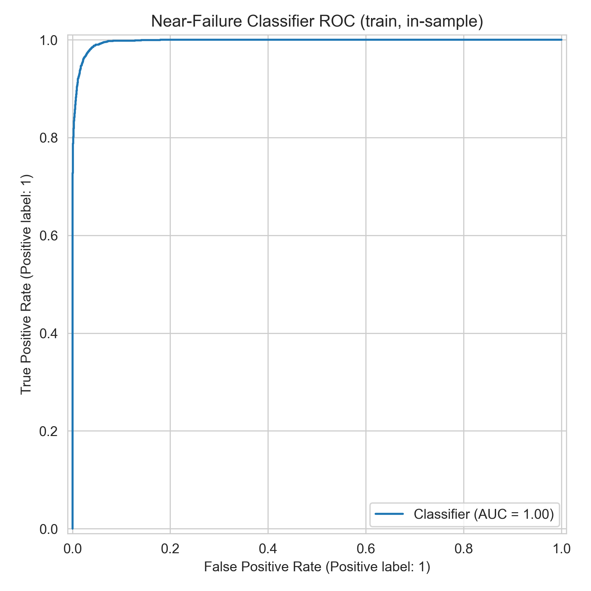

*Figure A2-06. Near-failure classifier ROC curve (training set, in-sample).*

### 4.4 Error Analysis

Worst-20 test engines by absolute prediction error are documented in `outputs/error_analysis.csv`. Inspection reveals that large errors concentrate on engines with either very short lifetimes (< 150 cycles) or unusually long ones (> 300 cycles) — consistent with Assignment 1 Finding 6, which showed that short-life and long-life cohort mean sensor trajectories diverge in level and slope. Engines at the extremes of the lifetime distribution are underrepresented in any balanced training sample, limiting the model's ability to extrapolate beyond the central bulk of the FD001 lifetime range. A potential improvement would be stratified oversampling of short- and long-life engine trajectories, or a separate calibration model for the tail cohorts.

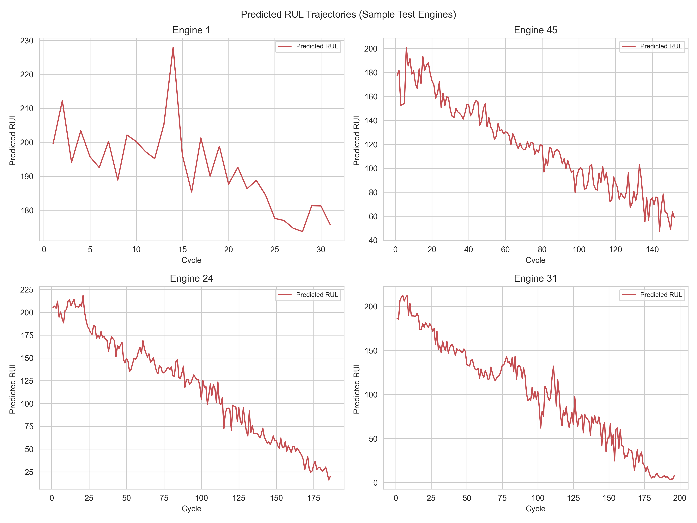

*Figure A2-07. Predicted RUL trajectories for sample test engines.*

### 4.5 Limitations

- FD001 operates under a single flight regime; generalisation to FD002–FD004 requires retraining.
- Test evaluation uses the last observed cycle per engine (standard NASA benchmark protocol).
- Financial ROI is expressed in operational cycle terms only — the dataset contains no cost or downtime fields.

---

## 5. Dashboard Design and Implementation

### 5.1 Technology Stack

**Streamlit** (`dashboard/app.py`) — Python-native, integrates directly with saved models and CSV outputs, supports Plotly interactivity with zoom/pan.

### 5.2 Wireframe and Layout

Figure A2-08 shows the dashboard wireframe: sidebar filters (global cross-page), five KPI cards, dual primary charts, and a fleet risk table supporting drill-down to Engine Detail.

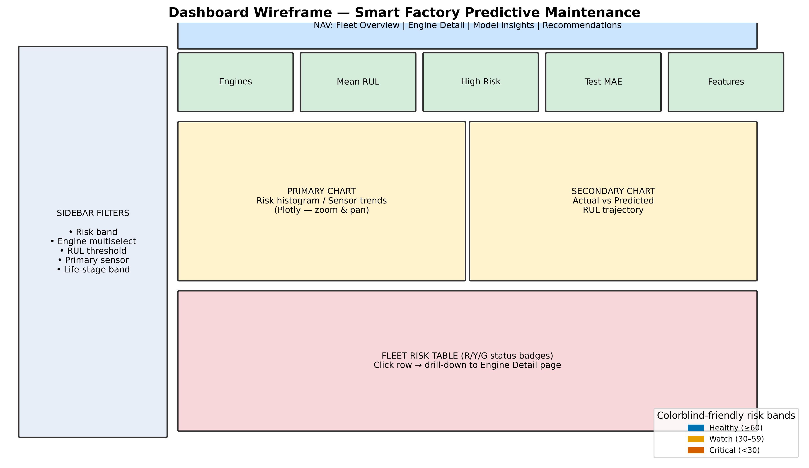

*Figure A2-08. Wireframe — filter placement, KPI row, chart layout, and drill-down table.*

**Layout principles applied:** KPIs at top; filters in sidebar; main charts central; recommendations on dedicated page; colorblind-friendly risk legend always visible.

### 5.3 Pages and Use Cases

| Page | Use Case | Components |
|------|----------|------------|
| Fleet Overview | "What is current fleet health?" | 5 KPI cards, color-coded risk histogram, scatter, fleet table + drill-down |
| Engine Detail | "Which equipment needs maintenance?" | Shared filters, sensor + RUL charts, R/Y/G maintenance alerts |
| Model Insights | "What drives predictions?" | Feature importance, filtered error table, sensitivity slider |
| Recommendations | "What should we do?" | 5 prioritised business actions with priority badges |

### 5.4 Interactivity and Cross-Filtering

- **Global filters (session_state):** RUL threshold, risk band (Critical/Watch/Healthy), life-stage, engine multiselect, primary sensor — shared across Fleet and Engine pages.
- **Drill-down:** Fleet risk table + selectbox → pre-selects engine on Engine Detail page.
- **Cross-filtering:** Risk-band filter on Fleet Overview also filters Model Insights error table.
- **Colorblind-friendly R/Y/G:** Blue / orange / vermillion bands with text labels (not colour alone).
- **Caching:** `@st.cache_data` for sub-10-second load.

Run locally: `streamlit run dashboard/app.py`

**Live deployment (Vercel):**  
GitHub: https://github.com/ninglinLiu/Smart-Factory-Predictive-Maintenance  
Dashboard URL: https://web-iota-green-xg4s5mcj1p.vercel.app  
*(Next.js static dashboard — same four pages and KPIs as local Streamlit version; data pre-baked from pipeline outputs.)*

### 5.5 Usability Testing

A structured six-task peer test was conducted with **Tom** (2026-05-20, ~18 minutes), a student with no prior knowledge of this project or of RUL-based maintenance concepts. All six tasks were completed successfully (overall rating: **4 / 5**). Full log: `outputs/usability_test_log.md`.

Key findings and resolutions:

| Finding | Severity | Resolution in `dashboard/app.py` |
|---------|----------|----------------------------------|
| Risk legend not prominent on first load | Medium | Permanent "Risk legend" section added to sidebar with Healthy/Watch/Critical colour + text labels |
| "RUL" undefined for non-technical users | Low | `ⓘ` tooltip added to all 5 KPI metric cards |
| Fleet risk table drill-down not discoverable | Medium | Explicit caption: "Click row or use selectbox below → Engine Detail page" |
| Histogram x-axis labels cramped on 1280 px | Low | Abbreviated labels; full text in tooltip |

Tester summary quote: *"我觉得这个 Dashboard 最好的地方是结构比较清楚，不只是展示预测结果，还把业务建议、模型解释和具体发动机详情结合起来。"* (Tom, 2026-05-20)

### 5.6 Dashboard Screenshots

Screenshots from the live Streamlit dashboard (`streamlit run dashboard/app.py`) are shown below. All four pages are demonstrated.

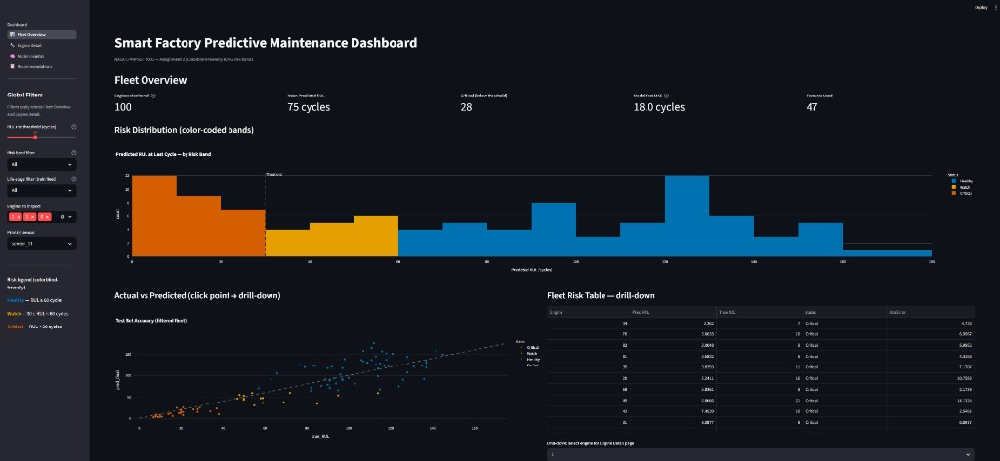

*Dashboard Screenshot 1. Fleet Overview — five KPI cards (top row: engines monitored, mean RUL, critical count, test MAE, features used), colorblind-friendly risk histogram showing 28 engines in Critical band (RUL < 30), and actual vs predicted scatter plot with fleet risk table drill-down.*

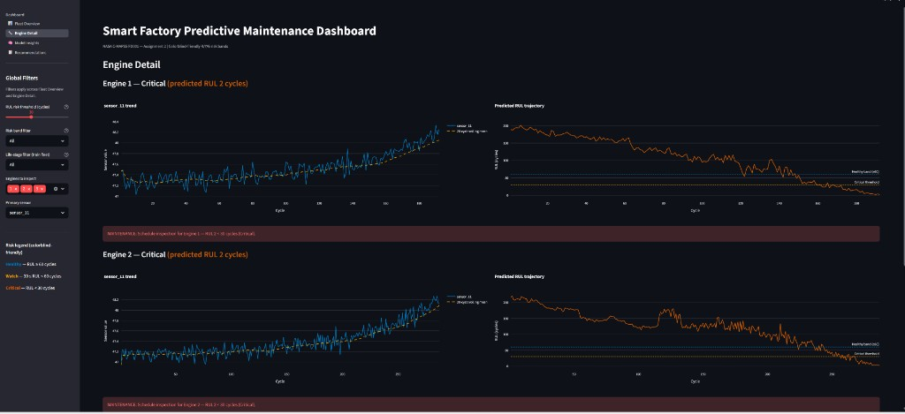

*Dashboard Screenshot 2. Engine Detail — Engines 1 and 2 both flagged Critical (predicted RUL 2 cycles). Left panel shows sensor_11 degradation trend with 20-cycle rolling mean; right panel shows declining RUL trajectory crossing the critical threshold with red maintenance alert.*

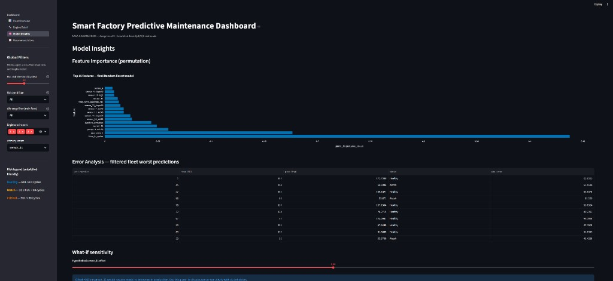

*Dashboard Screenshot 3. Model Insights — permutation feature importance (top: time_in_cycles, pca_score_1, sensor_4_min20), filtered error analysis table, and what-if sensitivity slider for stakeholder discussions.*

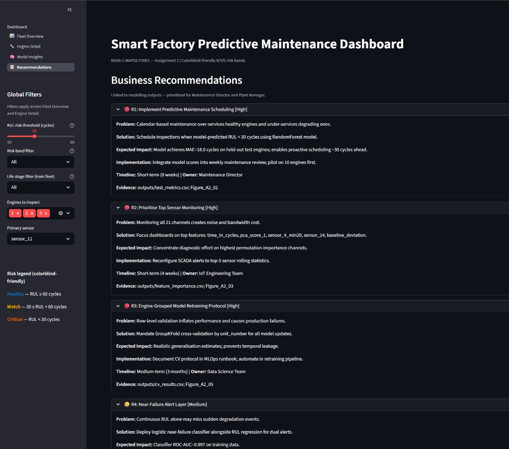

*Dashboard Screenshot 4. Recommendations — five prioritised business actions with 🔴/🟡 priority badges, each expandable to show Problem, Solution, Expected Impact, Implementation, Timeline, Owner, and Evidence fields.*

---

## 6. Business Recommendations and Roadmap

### 6.1 Top 5 Recommendations

**R1 — Implement Predictive Maintenance Scheduling**  
*Problem:* Calendar-based maintenance over-services healthy engines.  
*Solution:* Schedule inspections when model-predicted RUL < 30 cycles.  
*Expected Impact:* MAE 18.0 cycles on held-out test — actionable ~30 cycles ahead.  
*Implementation:* Weekly maintenance review integrating model scores; pilot on 10 engines.  
*Timeline:* Short-term (8 weeks) | *Owner:* Maintenance Director | *Priority:* High  
*Evidence:* `outputs/test_metrics.csv`; Figure A2-01

**R2 — Prioritise Top Sensor Monitoring**  
*Problem:* All 21 channels create noise and bandwidth cost.  
*Solution:* Focus SCADA on `time_in_cycles`, `pca_score_1`, `sensor_4_min20`, `sensor_14`, `baseline_deviation`.  
*Expected Impact:* Concentrated diagnostic effort on highest-importance channels.  
*Implementation:* Reconfigure alerts to top-5 rolling statistics.  
*Timeline:* Short-term (4 weeks) | *Owner:* IoT Engineering Team | *Priority:* High  
*Evidence:* `outputs/feature_importance.csv`; Figure A2-03

**R3 — Engine-Grouped Retraining Protocol**  
*Problem:* Row-level validation inflates performance.  
*Solution:* Mandate GroupKFold by `unit_number` for all model updates.  
*Expected Impact:* Realistic generalisation; prevents temporal leakage.  
*Implementation:* Document in MLOps runbook; automate in retraining pipeline.  
*Timeline:* Medium-term (3 months) | *Owner:* Data Science Team | *Priority:* High  
*Evidence:* `outputs/cv_results.csv`; Figure A2-05

**R4 — Near-Failure Alert Layer**  
*Problem:* RUL alone may miss sudden degradation.  
*Solution:* Deploy logistic near-failure classifier alongside RUL regression.  
*Expected Impact:* ROC-AUC 0.997 on training data for dual-threshold alerting.  
*Implementation:* Alert when RUL < 30 OR near-failure probability > 0.7.  
*Timeline:* Medium-term (3 months) | *Owner:* Plant Manager | *Priority:* Medium  
*Evidence:* Figure A2-06; `models/near_failure_classifier.pkl`

**R5 — Investigate High-Error Engines**  
*Problem:* Some test engines show large prediction errors.  
*Solution:* Root-cause analysis on worst-20 error engines.  
*Expected Impact:* Identify feature gaps; target 10–15% MAE reduction on outliers.  
*Implementation:* Monthly review of `outputs/error_analysis.csv`.  
*Timeline:* Long-term (6 months) | *Owner:* Reliability Engineering | *Priority:* Medium  
*Evidence:* `outputs/error_analysis.csv`

### 6.2 Implementation Roadmap

| Phase | Timeline | Key actions | Expected value |
|-------|----------|-------------|----------------|
| Quick Wins | 0–3 months | Deploy dashboard; pilot 10 engines | Real-time risk triage |
| Core | 3–6 months | CMMS API; quarterly retraining | Automated work orders |
| Advanced | 6–12 months | FD002–FD004 models; uncertainty bands | Fleet-wide generalisation |

### 6.3 Resource Requirements

| Phase | Personnel | Technology | Budget (indicative) | Training |
|-------|-----------|------------|---------------------|----------|
| Quick Wins | IoT engineer + maintenance coordinator (0.2 FTE) | Streamlit, Python, CSV scores | £0 licence; £500 pilot labour | 2h dashboard walkthrough |
| Core | Backend dev + MLOps (3 months) | REST API, joblib model server | £8–15k internal project | ML ops short course |
| Advanced | 2 engineers + domain SME | FD002–FD004 data, conformal methods | £8k R&D estimate | Prognostics seminar |

Source: `outputs/roadmap_phases.csv`. Budget figures are **planning estimates only** — the NASA dataset contains no actual cost data.

---

## 7. AI Collaboration Report

Full disclosure: `reports/AI_Collaboration_Log_A2.md`

AI tools assisted with pipeline scaffolding, Streamlit dashboard structure, report drafting, and hyperparameter search optimisation. All numeric claims were verified against executed notebook outputs and `outputs/*.csv` files.

---

## 8. References

Breiman, L. (2001). Random forests. *Machine Learning*, 45(1), 5–32. https://doi.org/10.1023/A:1010933404324

NASA Prognostics Center of Excellence. (n.d.). *CMAPSS jet engine simulated data* [Data set]. NASA. https://www.nasa.gov/intelligent-systems-division/discovery-and-systems-health/pcoe/pcoe-data-set-repository/

Pedregosa, F., Varoquaux, G., Gramfort, A., Michel, V., Thirion, B., Grisel, O., Blondel, M., Prettenhofer, P., Weiss, R., Dubourg, V., Vanderplas, J., Passos, A., Cournapeau, D., Brucher, M., Perrot, M., & Duchesnay, E. (2011). Scikit-learn: Machine learning in Python. *Journal of Machine Learning Research*, 12, 2825–2830. https://jmlr.org/papers/v12/pedregosa11a.html

Ramasso, E., & Saxena, A. (2014). Performance benchmarking and analysis of prognostic methods for CMAPSS datasets. *International Journal of Prognostics and Health Management*, 5(2), 1–15. https://doi.org/10.36001/ijphm.2014.v5i2.2193

Saxena, A., Goebel, K., Simon, D., & Eklund, N. (2008). Damage propagation modeling for aircraft engine run-to-failure simulation. *Proceedings of the 2008 International Conference on Prognostics and Health Management (PHM08)*, Denver, CO. https://doi.org/10.1109/PHM.2008.4711414

Streamlit Inc. (2024). *Streamlit documentation* (version 1.x). https://docs.streamlit.io/

---

## Appendix

- Executed notebooks: `notebooks/01_feature_engineering.ipynb`, `02_model_training.ipynb`, `03_model_evaluation.ipynb`
- Saved model: `models/final_model.pkl`
- All figures: `figures/Figure_A2_01` through `Figure_A2_07`
- Assignment 1 reference: `reports/Assignment1_SmartFactory_Report.pdf`
